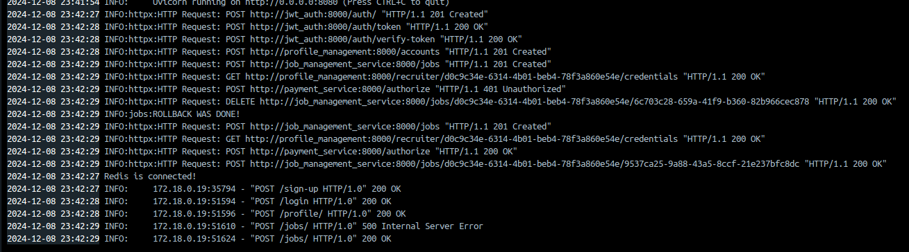

# Microservices Application

This repository defines a microservices-based architecture, using Docker Compose to orchestrate various services. The system is designed to be modular, with the intention of easily sclaing it in the future. We made it easy to test this application, this is why we put the secrets in our docker compose in plain text.

## Overview of Services

We will shortly summerize the structure of each service. The used database with each service is not mentioned seperatly.

### 1. **Gateway API (`api_gateway`)**
We have build our own gateway in FASTAPI, that fungates as a caching proxy and an orchestrator when multiple actions need to take place (including the SAGA). We have replicated this gateway threefold (with a nginx loadbalancer in front of it), this way offering redundancy and availability to our customers. Each of these instances has their own Redis cache, providing high speed response times and lower traffic to other called services. This service also implements retry-strategies, with random exponential backoff and implements a circuitbreaker if to much failure occurs in one service.
It also protects other microservices endpoints, by checking if the user is logged in and the user is allowed to perform that action using the auth service (discussed later).

- Structure of the gateway api service
  - `main.py` starts the FASTAPI app, defines the calls for login/signup, adds routers to other services
  - `<servicename>.py` are the endpoints that relay to that service, and adds protection to those private endpoints
  - `caching.py` defines all the caching functions used 
  - `retry_circuit_breaker.py` defines logic for combination of threadwide circuitbreaker and retry-strategies
  - `rest_interfaces/<servicename>_interfaces.py` are all the interfaces used in communication with the mentioned service
  - `rabbit.py` is code for defining a RabbitMQ publishing channel, used in `matching.py`


### 2. **JWT Authentication service (`jwt_auth`)**
The JWT Authentication Service manages user registration, login, and token verification. It interacts with the API Gateway to secure access to protected resources.

Key Functions:
User Registration (POST /auth/):

User is created by hashing the password with bcrypt and storing it in the database.
Login & Token Issuance (POST /auth/token):

User provides username and password. If valid, a JWT token is issued, which includes the username and user ID.
Token Verification (POST /auth/verify-token):

The token is sent to the Authentication Service for validation. If valid, user info is returned. If invalid, a 401 Unauthorized error is returned.
Interaction with API Gateway:
Login:

The API Gateway forwards login credentials to the JWT Authentication Service and returns the JWT token to the client.
Token Validation:

The API Gateway checks the Authorization header for a token, verifies it by calling the /auth/verify-token endpoint, and grants access if valid.
Caching:

The API Gateway caches user info associated with valid tokens to reduce redundant verification requests.
This system ensures secure, token-based user authentication for protected routes.

### 3. **Profile Management Service (`profile_management`)**
This service is responsible for CRUD actions on the profile of a JobSeeker or a Recruiter. It is designed to follow the union architecture, where there are only inward dependencies. It connects to a mysql database `mysql_profiles`. 

- Structure of the Profile Management Service:
  - `main.py` defines all the endpoints and uses the application layer
  - `application_layer` contains most of the logic , using dependency injection to insert the used DBadapters and PublisherAdapters
  - `domain_model` contains the state and minor functionality
  - `interfaces.py` define the interfaces for the adapters (application layer)
  - `rest_interfaces/*` contain the interfaces/ contracts with the gatewayAPI
  - `publisher.py` defines the publisher that implements the publisher adapter, and sends updates of the profile to the Recommendation service

### 4. **Job Management Service (`job_management_service`)**
This service is responsible for CRUD actions on the jobs for a given Recruiter. It is designed to follow the union architecture, just like the previous service and it almost has the same structure with some different functionalities. It connects to a mysql database `mysql_jobs`.

- Structure of the Jobs Management Service:
  - `main.py` defines all the endpoints and uses the application layer
  - `application_layer` contains most of the logic , using dependency injection to insert the used DBadapters and PublisherAdapters
  - `domain_model` contains the state and minor functionality
  - `interfaces.py` define the interfaces for the adapters (application layer)
  - `rest_interfaces/*` contain the interfaces/ contracts with the gatewayAPI
  - `publisher.py` defines the publisher that implements the publisher adapter, and sends updates of the job to the Recommendation service

### 5. **Matching Service**

The Matching Microservice is responsible for connecting jobseekers with job opportunities by leveraging recommendations from the `mysql_matching` database. It provides an API for the UI to fetch these recommendations and listens to swipe actions (like/dislike) from a message bus to process user preferences. When both a jobseeker and a recruiter express mutual interest, the service identifies a true match and sends it to a dedicated matches queue.

- Structure of the Matching Service:
  - `main.py` defines all the endpoints and uses the application layer
  - `application_layer` contains most of the logic , using dependency injection to insert the used DBadapters and PublisherAdapters
  - `domain_model` contains the state and minor functionality
  - `interfaces.py` define the interfaces for the adapters (application layer)


### 6. **Recommendation Service**

The Recommendation Service is a microservice designed to efficiently link jobseekers with jobs. It analyses incoming data and performs advanced searches to identify the best matches using ElasticSearch. The results are stored in a relational database for future use and retrieval.
The service listens to two RabbitMQ queues:

1. **job_update**: Handles new or updated job information.
2. **jobseeker_update**: Handles new or updated jobseeker information.

#### Jobseeker Update Processing Flow

1. **Receive Message**: A `jobseeker_update` message (in JSON format) is consumed from RabbitMQ.
2. **JSON to Java Object**: The JSON structure is deserialized into a Java object representing the jobseeker.
3. **ElasticSearch Update**: The jobseeker data is inserted/updated in the ElasticSearch database.
4. **Find Matches**:
   - Searches the ElasticSearch database for matching jobs based on predefined criteria.
   - Leverages ElasticSearch's advanced query capabilities for efficient and fast results.
5. **Process Matches**:
   - Store new matches in the MySQL database.

The Processing Flow for job updates is equivalent.


- Structure of the Recommendation Service
  - `main.java` Sets up and configures the necessary components.
  - `Job.java, JobSeeker.java, Salary.java` are the Java classes that correspond to these entities and are deserialized from JSON messages received from the message broker.
  - `ElasticsearchConnector.java` sets up the connection to the Elasticsearch database using the right credentials
  - `ElasticDB.java` Provides methods for inserting and retrieving jobseekers and jobs into the database. Executes search queries to match jobseekers with relevant jobs based on their profiles.
  - `MatchingDB.java` sets up the connection to the *mysql_matching* database. It contains a method to insert recommendation matches.
  - `Match.java` is a simple class to store a recommendation match.
  - `RabbitClient.java` sets up the connection to RabbitMQ and starts consuming from two seperate queues. It contains the callback functions to process a new message.

## How to Run the Application

### Prerequisites
- Ensure that Docker and Docker Compose are installed on your system.

### Steps to Start
1. Clone the repository to your local machine.
2. Navigate to the project directory.
3. Build and start the services using Docker Compose:
   ```bash
   docker-compose up --build


## How to Test the Application

### Prerequisites
- Ensure that `newman` is installed on your system

### Steps to start
#### 1. Populate the application with random Jobseekers and Recruiters
First, the application needs some mock data so you'll be able to swipe and match in the following steps.
The data is added to the application with a bash script that calls 2 postman scripts:
- `add-jobseeker.json`: creates 50 jobseekers
- `add-recruiters-and-create-jobs`: creates 30 recruiters, where each of them creates 5 jobs

A third json-file is included to ensure the environment variables used in the scripts can be found.
The Postman scripts execute HTTP-requests to the api_gateway. In a later step, you'll be using the same endpoints to create your own profile.

The script is executed by running the following commands in the root directory of the project (this shouldn't take more than 3 minutes):
```bash
chmod +x run_scenario.sh
./run_scenario.sh
```
In the terminal, you should see 3 calls for the creation of each Jobseeker:
- `sign-up`: creates a username and password
- `login`: login using the newly created username and password
- `create profile`: fills in personal details of the Jobseeker

When the creation of the Jobseekers finishes, the scripts starts doing 8 calls for each Recruiter:
- `sign-up`: creates a username and password
- `login`: login using the newly created username and password
- `create profile`: fills in personal details of the Recruiter
- 5x `create job`: creates 5 jobs with their own random details

When the script finishes, it's time to move on to the next step.

#### 2. Create your own profile as a Recruiter
For this step, you are going to manually sign-up, login and create a profile as a Recruiter.
This can easily be done using the UI (http://localhost:3000).
Once landed on the UI, follow these steps:
1. Click on the profile icon in the top left of your screen.
2. You don't have an account yet, so click on `Sign up` to create one.
3. Create an account by choosing your username and password.
4. Login using the account credentials you just created. You should be welcomed on your personal profile page!
5. Since you're going to be posting jobs, you'll fill in a Recruiter profile. (click the toggle button to toggle to Recruiter)
6. Fill in all the fields as you like.
7. Click `create profile`. You should see your newly created profile with your personal information.
8. (optional) You can change you're company name when you switch jobs.
9. Start creating a new job post by clicking `CREATE JOB` at the bottom of the page.
10. Fill in the fields, BUT pay some attention to the following ones:
- `Location`: will be used to recommend certain Jobseekers. Choose one of the following: `Bangalore,Beijing,Stockholm,Helsinki,Vancouver,Toronto,Ghent`
- `Requirements`: this has to be a comma-seperated list -> the requiremends will be used to recommend your job to Jobseekers meeting at least one of your stated requirements. For the best results, use all or most of these requirements: `Bachelor of Science in Computer Science,Master of Science in Artificial Intelligence,PhD in Data Science,Diploma in Software Engineering,Certification in Cloud Computing,Course in Cybersecurity,Certification in Machine Learning,Course in Blockchain Technology,Certification in Full-Stack Development,Diploma in Information Technology,Bachelor of Engineering in Computer Systems,Diploma in Embedded Systems,Master of Science in Robotics,Bachelor of Science in Data Analytics,Certification in DevOps,Course in Mobile Application Development,Diploma in Network Engineering`
11. Click `Create job`.

Now that you have created a job post, you are going to create your own Jobseeker profile to search for your newly created job.


#### 2. Create your own profile as a Jobseeker
For this step, you are going to manually sign-up, login and create a profile as a Jobseeker.
This can easily be done using the UI (http://localhost:3000).
Once landed on the UI, follow these steps:
1. Click on the profile icon in the top left of your screen.
2. You don't have an account yet, so click on `Sign up` to create one.
3. Create an account by choosing your username and password.
4. Login using the account credentials you just created. You should be welcomed on your personal profile page!
5. Since you're going to be looking for jobs, you'll fill in a Jobseeker profile. (this is selected by default)
6. Fill in all the fields as you like, BUT pay some extra attention to the following ones:
- `Qualifications`: This is again a comma-separated field. Enter at least one qualification that you added when creating the job.
- `Location`: Enter the same location as you chose to create the job. This will ensure your job will be recommend to you as a Jobseeker.
- `Salary`: best kept to the default value of `{}`
7. Click `create profile`. You should see your newly created profile with your personal information.
8. (optional) Made a mistake? You can update you personal information at the bottom of the page.

Now that you've created your own Jobseeker profile, it's time to move on to the next step.

#### 3. Start swiping!
You're still on the profiles tab? Click `Job Finder` on the top menu to go to the swipe page.

(If you're seeing no recommendations, try refreshing the page and wait a couple seconds)

You can swipe by dragging the cards or by using the buttons.
- Swipe left to dislike a job offering
- Swipe right to like a job offering

Keep swiping until you found the job you created! Swipe this job to the right and only then you can move on to the next step.

#### 4. Log back in with your Recruiter profile
1. Go back to the profile page.
2. Scroll down until you see the job you created.
3. Click on the job. It should have turned green.
4. Click on `Job Finder` to start swiping (refresh the page if necessary)
5. Keep swiping until you find your Jobseeker profile and swipe it right.

IT'S A MATCH! Now that your Recruiter and Jobseeker profiles both swiped right on each other, you should see a new match in your notifications.

#### 5. View your matches
1. Click on the notifications icon in the top right corner.
2. Your matches are displayed here.


## How to test the SAGA
The saga is explained in the file uploaded on Ufora. To test the saga, run the `showcase_saga.sh` script using the following commands in the root folder of this project.
```bash
chmod +x showcase_saga.sh
./showcase_saga.sh
```
This script will create a job where the payment value is set to 0 and a job where the value is set to 1.
The first one will fail in the payment service since the payment won't be authorized. This will rollback the previous step of storing the new job in the database. The job will be deleted from the database and a 500-status will be returned.

The second one will succeed and a new job will posted on the job_update queue of the recommendations service.

The output in the api_gateway container should look like this:



## How to test the retries and the circuitbraker
Before updating a profile, you can stop the profile management service in Docker Desktop. Once stopped, attempt the update while monitoring the application logs (in the terminal where you ran docker compose up). You'll notice the application retrying with a random exponential backoff. After three manual update attempts (resulting in a total of nine retries due to internal retries in the gateway), the circuit will open, causing the request to fail fast. At this point, restart the service in Docker Compose. Once the circuit breaker timeout expires, the update process will work again.
